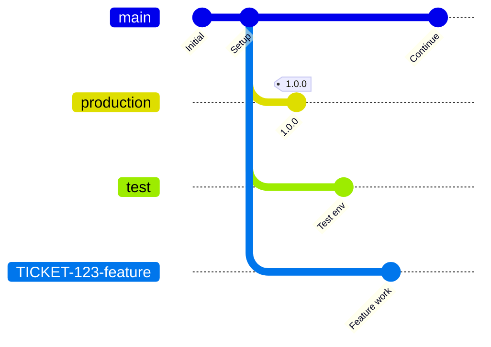
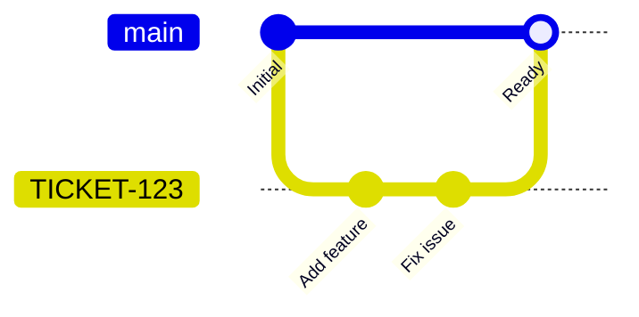
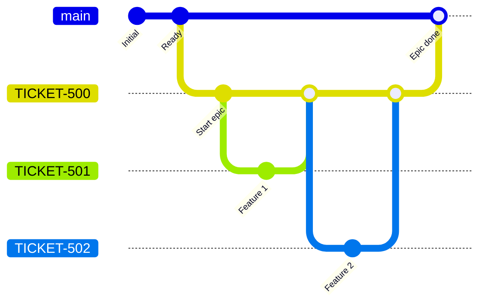
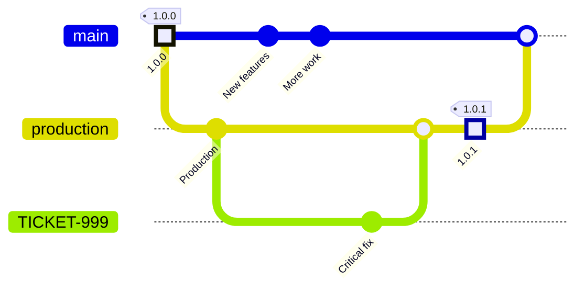
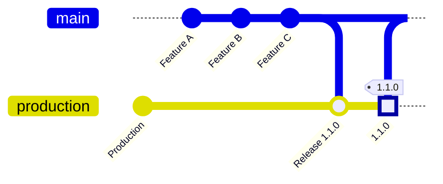

# Git WunderFlow

Modern Git workflow for multiple development tracks with clean releases and reliable hotfixes.

## Overview

WunderFlow is a simplified Git branching strategy:

- Multiple concurrent development tracks
- Clean releases with semantic versioning
- Reliable hotfix workflow
- CI/CD integration

## Branch structure



### Main

- **Purpose**: Integration and QA for next release
- **Deployment**: Automatic on push
- **Base**: All feature branches start here

### Production

- **Purpose**: Production environment
- **Deployment**: Automatic on tag push (after approval)
- **Updates**: Merges from `main` (releases) or hotfix branches (PRs), both followed by tagging

### Test

- **Purpose**: Integration testing, customer demos, testing with real user data
- **Deployment**: Automatic on push
- **Reset**: Can be reset to `main` anytime
- **Agreement**: Requires team and client agreement
- **GDPR**: Allows avoiding specific users from anonymization (via `gdprDump`) for testing authentication and integrations
- **Use cases**: Essential for multi-service projects and testing third-party integrations (SSO, APIs, etc.)

### Feature branches

- **Purpose**: Development of individual features, fixes, or tasks
- **Deployment**: Automatic on push (manual approval)
- **Base**: Created from `main`
- **Lifecycle**: Short-lived, deleted after merge
- **Naming**: `TICKET-NUMBER-description`

## Branch naming

**Format**: `TICKET-NUMBER-description`

```bash
TICKET-123-add-user-authentication
TICKET-456-fix-payment-gateway
TICKET-789-new-checkout-flow
```

**Rules**:

- Use ticket number from your issue tracker
- Lowercase with hyphens
- Descriptive but concise
- No prefixes

**Important**: Epic/feature/hotfix distinctions are handled differently:

- **Epic relationships**: Defined in ticketing system (JIRA, etc.)
- **Change types**: Defined in commit messages using [conventional commits](#commit-format)

Branch names contain only ticket numbers. The ticket system tracks epic relationships. Commit types (`feat`, `fix`, etc.) categorize changes.

## Workflows

### Feature development



```bash
# Create branch
git checkout main && git pull
git checkout -b TICKET-123-add-search

# Develop and commit
git add .
git commit -m "feat(TICKET-123): Add search functionality"
git push origin TICKET-123-add-search

# Test (optional)
git checkout test && git pull
git merge --no-ff TICKET-123-add-search
git push origin test

# Create PR to main, merge after approval, delete branch
```

### Epic features

For large projects with dependent features:



```bash
# Create epic branch (epic is ticket property)
git checkout main && git pull
git checkout -b TICKET-500-new-checkout

# Create feature branches from epic
git checkout -b TICKET-501-cart-updates

# Merge features to epic
git checkout TICKET-500-new-checkout
git merge --no-ff TICKET-501-cart-updates

# Test epic
git checkout test
git merge --no-ff TICKET-500-new-checkout
git push origin test

# Merge epic to main via PR, delete branches
```

### Hotfix workflow



```bash
# Create from production
git checkout production && git pull
git checkout -b TICKET-999-critical-fix

# Fix and commit
git add .
git commit -m "fix(TICKET-999): Fix critical security issue"
git push origin TICKET-999-critical-fix

# Test
git checkout test && git pull
git merge --no-ff TICKET-999-critical-fix
git push origin test

# Merge to production via PR, then tag
git checkout production && git pull
git tag 1.0.1
git push origin 1.0.1

# Sync main
git checkout main && git pull
git merge production
git push origin main

# Delete branch
```

### Release workflow



```bash
# Verify main is ready
git checkout main && git pull
# Test at https://main.project-name.dev.wdr.io

# Check current version
git describe --tags --abbrev=0

# Merge to production
git checkout production && git pull
git merge main -m "Release 1.1.0"
git push origin production

# Create and push tag
git tag 1.1.0
git push origin 1.1.0

# Approve deployment in CI/CD, verify production
```

## Commit format

**Required**: [Conventional Commits](https://www.conventionalcommits.org/) (enforced via Husky/GrumPHP)

**Format**: `type(ticket-number): Description`

```bash
feat(TICKET-123): Add user authentication
fix(TICKET-456): Fix payment gateway timeout
docs(TICKET-789): Update API documentation
refactor(TICKET-012): Simplify database queries
```

**Types**:

- `feat`: New feature (MINOR version)
- `fix`: Bug fix (PATCH version)
- `docs`: Documentation
- `refactor`: Code refactoring
- `test`: Tests
- `build`: Build system
- `ci`: CI/CD configuration
- `chore`: Other changes

**Breaking changes**:

```bash
feat(TICKET-123)!: Change authentication API

BREAKING CHANGE: Old authentication endpoints removed
```

## Semantic versioning

**Format**: `MAJOR.MINOR.PATCH`

- **MAJOR** (1.0.0): Breaking changes
- **MINOR** (0.1.0): New features
- **PATCH** (0.0.1): Bug fixes

**Rules**:

- `feat` → MINOR
- `fix` → PATCH
- Breaking changes → MAJOR
- `docs`, `refactor`, `test`, `chore` → PATCH

## Pull requests

**Template**: [.github/pull_request_template.md](.github/pull_request_template.md)

**Format**:

- Group commits by type (feat, fix, docs, etc.)
- Include testing environments and instructions
- Propose version tag for releases

## Release notes

**Default**: GitHub releases

After pushing a tag, release manager creates a GitHub release:

```bash
# Push tag
git tag 1.2.0
git push origin 1.2.0

# Create release on GitHub
# Go to: https://github.com/org/repo/releases/new
# Select tag: 1.2.0
# Click "Draft a new release" to auto-generate from commits
```

**Optional**: Manual changelog (requires team agreement)

Teams can maintain [CHANGELOG.md](https://keepachangelog.com/) for curated release notes:

```markdown
# Changelog

## [1.2.0] - 2024-01-15

### Added
- User authentication (TICKET-123)
- Payment gateway integration (TICKET-456)

### Fixed
- Session timeout issue (TICKET-789)
```

Update before each release, commit with the release.

## CI/CD integration

See [docs/circleci-config-drupal.md](docs/circleci-config-drupal.md) guide for Drupal projects.

**Environments**:

- Feature branches: `https://ticket-123-feature-a1b2c3.project.dev.wdr.io` (manual approval)
- Test: `https://test.project.dev.wdr.io` (automatic)
- Main: `https://main.project.dev.wdr.io` (automatic)
- Production: `https://production.example.com` (manual approval)

**Note**: Feature branch URLs are sanitized (lowercase, hyphens) with a hash suffix for uniqueness.

## Best practices

### Branch management

- Keep branches short-lived (< 1 week)
- Delete after merging
- Use pull requests for `main` (and `production` only for hotfixes)
- Require code review
- Use squash merging
- Deploy `main` → `production` via tagging, not PR

### Commit practices

- Clear, descriptive messages
- Follow conventional commits
- Include ticket number
- Atomic commits
- Run tests before committing

### Testing

- Test locally first
- Use feature environments
- Test in staging before release
- Verify production after deployment

## Troubleshooting

### Feature deployment not starting

**Cause**: Manual approval required

**Solution**: Approve in CI/CD interface

### Production deployment not triggered

**Cause**: Tag format incorrect

**Solution**: Use `1.2.3` not `v1.2.3`

### Merge conflicts

**Solution**: Keep feature branch updated with `main`

```bash
# Update feature branch (recommended: rebase)
git checkout TICKET-123-feature
git fetch origin
git rebase origin/main
git push --force-with-lease

# Alternative: merge
git merge origin/main
git push
```

**Update frequency**:

- Daily for long-running features
- Before creating PR
- After major `main` changes

**Epic branches**:

```bash
# Update epic from main
git checkout TICKET-500-epic
git rebase origin/main

# Update features from epic
git checkout TICKET-501-feature
git rebase TICKET-500-epic
```

## Resources

- [CircleCI config for Drupal](docs/circleci-config-drupal.md)
- [Conventional Commits](https://www.conventionalcommits.org/)
- [Keep a Changelog](https://keepachangelog.com/)
- [Semantic Versioning](https://semver.org/)
- [Silta documentation](https://github.com/wunderio/silta)
- [Silta orb](https://circleci.com/developer/orbs/orb/silta/silta)

## Contributing

Improvements to WunderFlow are welcome:

1. Fork the repository
2. Create feature branch
3. Make changes
4. Submit pull request

## License

WunderFlow is open source and available under the MIT License.
